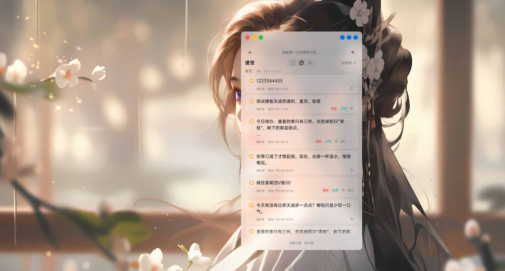
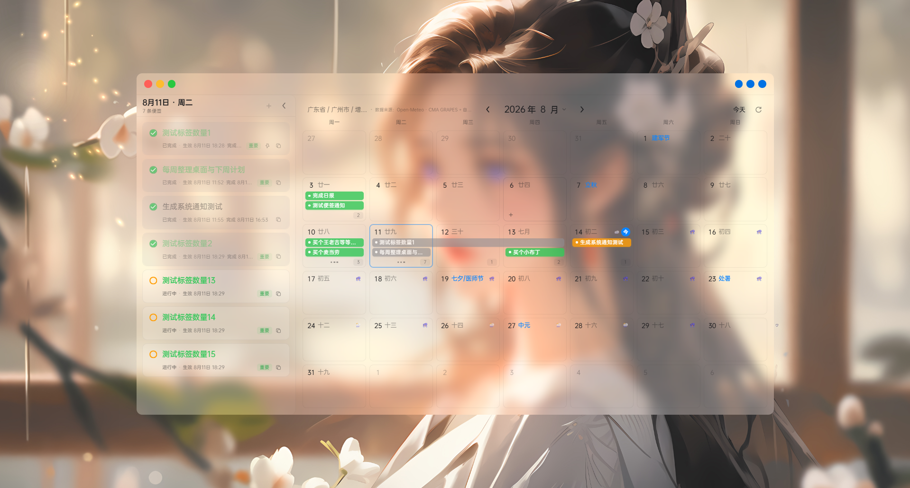
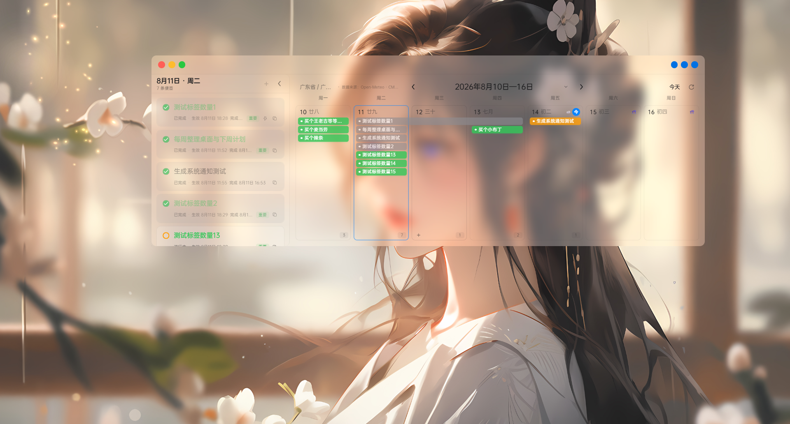
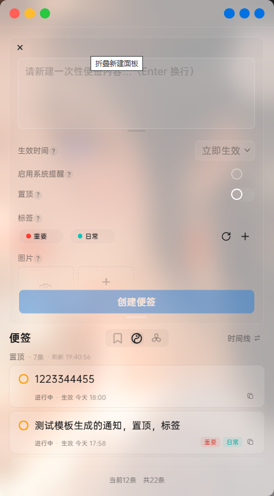
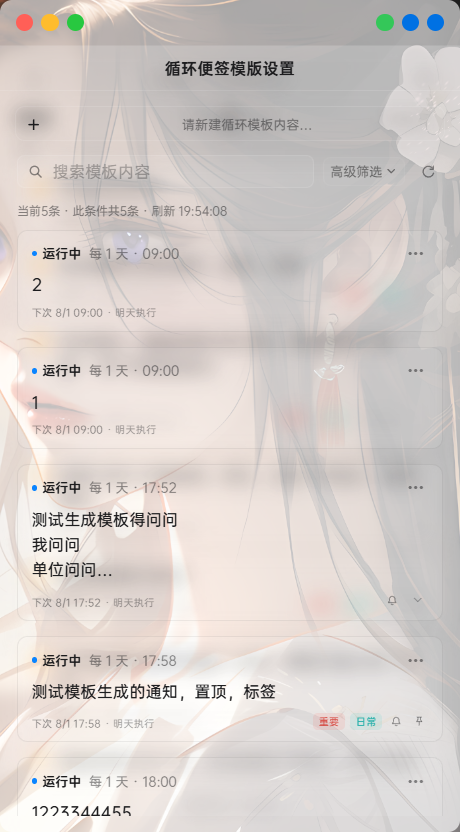
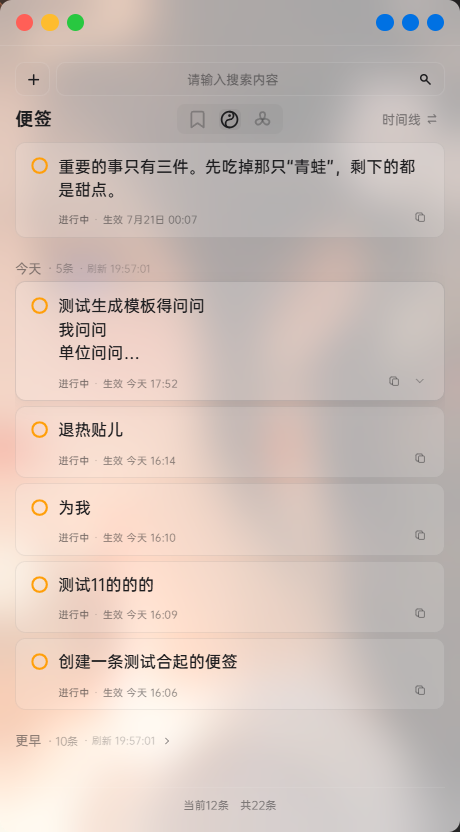
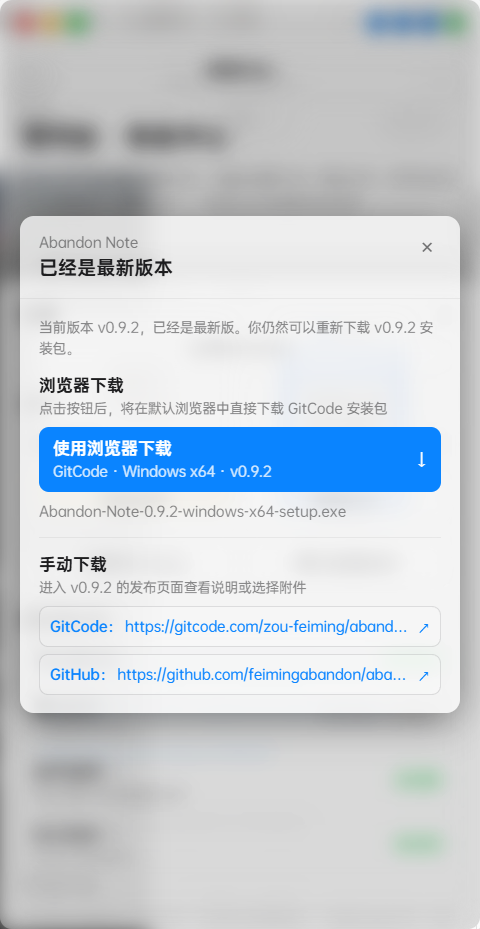
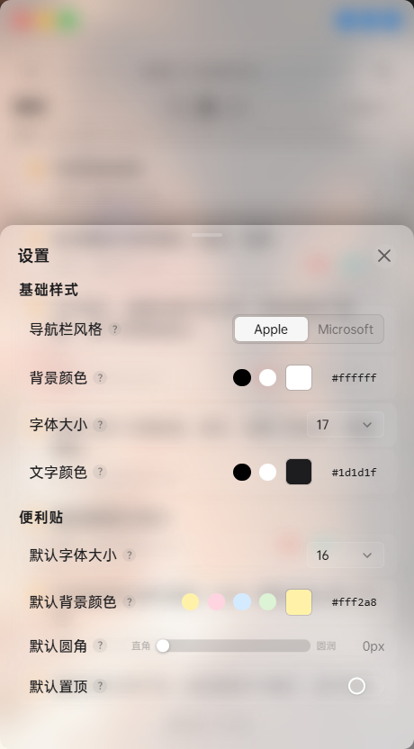
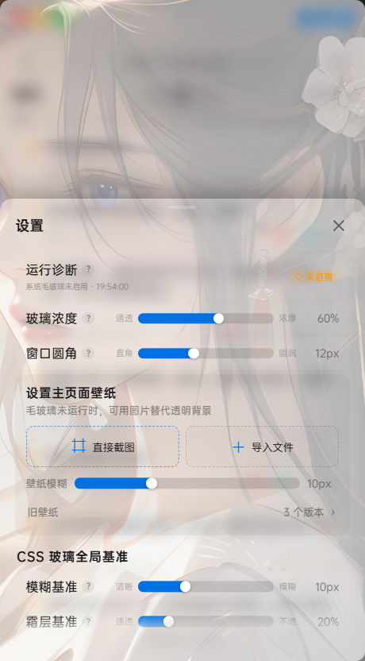

<div align="center">


# Abandon便签（Abandon Note）

**一款简洁、可靠的 Windows 桌面便签应用**

[](https://github.com/feimingabandon/abandon_note2/releases)
[](https://github.com/feimingabandon/abandon_note2/actions/workflows/ci.yml)
[](LICENSE)


支持 Windows 10 / 11

</div>

---

## 写在前言

2025年是一切罪恶的开始，作者正在失业的煎熬中。本想找免费的便签写点规划。谁成想，开源的风终究是没吹到这个便签赛道上。于是，作者一怒之下，决定自己写一个。毕竟这么简单的东西居然收费，不可理喻！虽然后来发现好像写起来并不简单。但是那些软件也有够丑的。都2026年了，怎么忍心将这些丑东西放在我的电脑上。而且的而且，软件联网，多端互通。这我写的小秘密不就都泄露出去了吗。可恶！所以Abandon便签0.0.1版问世了。

过程是坎坷的，结果是稀碎的。第一次开发正儿八经软件的作者才发现要处理的问题很多。多屏，多尺寸，多缩放等等始料未及的问题以至于它像个玩具。还是一碰就碎的那种。可惜，冥冥之中似乎有种力量推动我前行。虽然软件稀碎，但自从发布小红书，却受到了很多人的喜欢，即使在2026年的今天，仍然时常有人点赞收藏。也会有很多同志给我提出建议。坦白讲，我受之有愧。虽然从初版问世起就一直琢磨要重构它。但人性是丑陋的，我懒惰，拖延。只能一次次延期。也因此，很长一段时间不敢打开小红书。不敢面对你们的点赞收藏。但无可奈何的是，小红书的通知消息还是时不时推送到我的手机上。以至于每一次的推送，点赞，收藏，评论。都仿佛在告诉我，有很多人在等我。等我干翻现在这些丑陋的便签付费软件。

人总是会给自己附加上奇怪的使命感。仿佛自己的出现就是为了打败什么。这固然很中二。所以允许我再说一句中二的话：当我敲下第一行属于Abandon便签的代码时，我就知道。它就是这个赛道的天下第一。

过程自然不会一帆风顺，但不必多言。我只想让你知道。别的软件有的，它也有。别的软件没有的，它还有。

什么月视图，周视图，列表，标签分组，模板循环便签。无需多言。

它最大的优点是交互！

支持win10和win11原生毛玻璃。可任意调节毛玻璃样式，你喜欢的样子它都有。

支持贴边隐藏。像QQ那样。如果你觉得容易误触，还可以开启小黑条。

支持丰富的样式功能。设置页面值得你去探索。

支持丰富的交互动画。让每一次点击都赏心悦目。

全局采用苹果UI风格，简约≠简单。美好恰如其分。

永久免费开源，作者只图名不求利。

你的推荐，我求之不得。

Abandon便签，等你来探索...

## ☕ 赞赏支持

如果 Abandon便签恰好帮到了你，可以请作者喝杯咖啡。金额不重要，0.01 也是对作者最大的肯定。

| 微信赞赏 | 支付宝 |
| :---: | :---: |
|  |  |

> 赞赏完全自愿，不会解锁任何隐藏功能。不赞赏，也依然可以完整地使用 Abandon便签。

## 📖 项目介绍

Abandon便签（Abandon Note）是一款永久免费开源、以本地存储为核心的 Windows 桌面便签应用，目前支持 Windows 10 / 11。

- **三种主视图** — 通过便签列表集中整理内容，也可以在月视图和周视图中按日期安排与回顾。
- **桌面原生体验** — 支持桌面便利贴、贴边隐藏、系统提醒与 Windows 原生毛玻璃。
- **本地优先** — 便签、标签、循环模板、图片附件和壁纸保存在当前设备中，不要求登录账号，也不提供云同步。
- **持续开放** — 项目基于 GPL-3.0-only 许可证开放源码，当前仍处于内测阶段，会继续完善功能、交互与 Windows 使用体验。

如果你有想法、建议或使用反馈，欢迎提交 Issue，或发送邮件至：1160653906@qq.com。

## ✨ 功能特性

- 📝 **便签管理** — 创建、编辑、标签分类、置顶，按时间线分组浏览
- 🗓 **月历与周历** — 在月视图、周视图中查看和管理便签，支持农历、节气、节日及法定休班标记
- 🌤 **天气预报** — 在日历中展示天气图标与高低温，支持手动选择地区或按需使用设备位置
- 🔁 **循环便签** — 基于模板的周期性便签，由统一调度器自动生成，到点提醒
- 📌 **桌面便利贴** — 将便签钉在桌面，随时查看，支持多张同时展示
- 🫥 **贴边隐藏** — 窗口拖到屏幕边缘自动收起，鼠标移入触发区即滑出
- 🌫 **原生毛玻璃** — Windows 下通过 Windows.UI.Composition 实现系统级模糊背景
- 🖼 **图片与截图** — 支持粘贴图片附件、配置便签壁纸
- 🔔 **提醒通知** — 到期提醒走系统原生通知，附带应用内降级兜底
- 📄 **日报导出** — 按日期和状态筛选便签，预览后导出为 TXT 文件
- 📖 **帮助中心** — 内置图解式使用说明，覆盖便签、日历、便利贴和设置等主要功能
- 🔄 **更新检查** — GitHub / GitCode 双源检查新版本，前往发布页手动下载安装
- 💾 **本地存储** — 数据保存在本地 SQLite 数据库，不依赖网络

## 🖥 应用界面

**主界面** — 毛玻璃背景下的便签列表，支持置顶分组与时间线浏览



**标签分组列表** — 以标签分组整理便签，列表、月视图和周视图可随时切换

<div align="center">
  
</div>

| 月视图 | 周视图 |
| :---: | :---: |
|  |  |

**桌面便利贴** — 便签钉在桌面随时查看，支持调整字号、颜色与置顶


**贴边隐藏** — 窗口拖到屏幕边缘自动收起，鼠标移入触发区即滑出


| 新建便签 | 循环便签模板 |
| :---: | :---: |
|  |  |

| 时间线模式 | 更新检查 |
| :---: | :---: |
|  |  |

| 基础样式设置 | 毛玻璃与壁纸设置 |
| :---: | :---: |
|  |  |

## 💽 下载安装

从以下任一渠道下载最新版安装包：

- [GitHub Releases](https://github.com/feimingabandon/abandon_note2/releases)
- [GitCode Releases](https://gitcode.com/zou-feiming/abandon_note2/releases)

### Windows

下载 `Abandon-Note-x.y.z-windows-x64-setup.exe` 安装包，双击安装即可。

> 应用支持自动检查更新，检测到新版本后前往发布页下载安装包，覆盖安装即可升级。

## ⌨️ 本地开发

### 环境要求

- Node.js 22（项目使用 [Volta](https://volta.sh/) 锁定版本）
- Windows 下编译原生毛玻璃模块需要 Visual Studio C++ 构建工具与 CMake

### 克隆与安装依赖

```bash
git clone https://github.com/feimingabandon/abandon_note2.git
cd abandon_note2
npm install
```

### 开发模式

```bash
npm run dev
```

### 测试与检查

```bash
npm test        # vitest 单元测试 + Electron 集成测试
npm run lint    # eslint 检查
```

界面、主题和组件样式改动请遵守 [UI 材质与边线开发标准](docs/UI_DESIGN_STANDARD.md)。

### 构建打包

```bash
npm run build:win        # Windows：先编译原生毛玻璃模块，再打 NSIS x64 安装包
```

## 🛠 技术栈

| 层 | 技术 |
| --- | --- |
| 桌面框架 | [Electron](https://www.electronjs.org/) 43 |
| 前端 | [Vue 3](https://vuejs.org/) + [electron-vite](https://electron-vite.org/) |
| 数据存储 | [better-sqlite3](https://github.com/WiseLibs/better-sqlite3)（本地 SQLite） |
| 日历数据 | [chinese-days](https://github.com/vsme/chinese-days)（农历、节气与中国节假日） |
| 天气服务 | [Open-Meteo](https://open-meteo.com/)（预报与地理编码 API） |
| 原生能力 | C++（Windows.UI.Composition 毛玻璃）+ [koffi](https://koffi.dev/) FFI 桥接 |
| 打包 | [electron-builder](https://www.electron.build/) |


## 💐 感谢与致谢

Abandon便签的天气、定位与日历能力离不开以下开源项目和开放 API，在此向它们的维护者与服务提供方表示感谢：

- [Open-Meteo](https://open-meteo.com/) — 提供天气预报与地理编码 API；中国地区优先使用其接入的 CMA GRAPES 预报模型。
- [BigDataCloud](https://www.bigdatacloud.com/) — 提供反向地理编码 API，仅在用户主动选择“使用设备位置”时用于将坐标转换为地区名称。
- [chinese-days](https://github.com/vsme/chinese-days) — 提供农历、二十四节气、中国法定节假日、调休与工作日数据。
- [@aurouscia/china-areas](https://gitee.com/au114514/au-npm-pkgs/tree/master/packages/china-areas) — 提供本地中国行政区划数据，用于手动选择天气地区。

### 测试人员

感谢所有参与测试、反馈问题并帮助改进 Abandon便签的朋友。

<!-- 后续在此处补充测试人员名单。 -->

- 名单待补充

## 🤝 参与贡献

欢迎提交 [Issue](https://github.com/feimingabandon/abandon_note2/issues) 反馈问题或建议；提交 PR 前请确保 `npm run lint` 与 `npm test` 通过。

## 📜 许可证

本项目基于 [GNU GPL v3](LICENSE)（`GPL-3.0-only`）开源。
