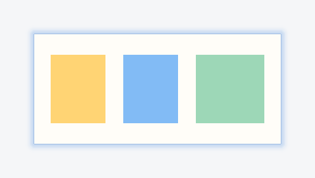

# 贴图柔和外光晕：实现与局部验收

日期：2026-09-29。依据用户提供的参考截图，把贴图常驻蓝色实线改为细边外侧渐隐的浅蓝光晕。本轮仅调整贴图显示装饰及其自动选区排除逻辑；不宣称与 Snipaste 实机逐像素一致。

## 完成的行为

- 图片内容窗口保持原来的位置、尺寸和像素，光晕仅在内容外侧绘制；复制、保存仍读取图像文档，不包含光晕。
- 光晕采用四条窄的 Windows 分层窗口，Qt 绘制预乘透明度像素。沿用现有 Qt Widgets、GDI/User32 依赖，没有新增运行库或独立进程。
- 每条装饰窗口归属对应贴图，带 `WS_EX_TRANSPARENT`、`WS_EX_NOACTIVATE`、`WS_EX_TOOLWINDOW`，不接收鼠标或焦点，不生成任务栏按钮。窗口大小、位置和透明度跟随贴图；隐藏、最小化、关闭和销毁同步回收显示。
- 移除原先绘制在图片边缘上的常驻蓝线。贴图编辑时已有的对象控制框仍保留，两者语义独立。
- 物理像素决定光晕窗口边界，避免 125% 下逻辑坐标二次取整压入图片一像素。绘图缓冲只覆盖屏幕可见的周边，移动时复用；缓冲大小纳入已有贴图内存统计。
- 自动窗口检测排除装饰窗口，继续把图片本身识别为选区。窗口句柄在原生销毁回调中清空，避免 Qt 重建宿主句柄时使用已失效的值。
- 与便签的生命周期不变，装饰窗口仍属于便签托管的截图进程。

主要实现：[PinHalo.cpp](../../native_capture/engine/PinHalo.cpp)、[PinWindow.cpp](../../native_capture/engine/PinWindow.cpp)、[DesktopTargets.cpp](../../native_capture/platform/windows/DesktopTargets.cpp)。

## 预览

这些是测试画布的合成预览，使用与原生窗口相同的绘制代码和实际窗口几何；没有使用用户桌面壁纸或第三方图片。

[深色背景](evidence/2026-09-29-pin-halo/accepted-1/dark.png)、[复杂背景](evidence/2026-09-29-pin-halo/accepted-1/pattern.png)、[125%](evidence/2026-09-29-pin-halo/accepted-1.25/light.png)、[150%](evidence/2026-09-29-pin-halo/accepted-1.5/light.png)、[200%](evidence/2026-09-29-pin-halo/accepted-2/light.png)。已查看浅色、深色、复杂背景及分数缩放预览。

## 最终测试结果

环境：Windows 11、MSVC、Qt 6.8.3；`QT_QPA_PLATFORM=windows`。四档缩放通过进程环境 `QT_SCALE_FACTOR` 设置，没有改系统显示设置，不等价于真实混合 DPI 多屏切换。

| 专项 | 结果 | 证据 |
| --- | --- | --- |
| C++ 最终构建 | 退出码 0 | [构建日志](evidence/2026-09-29-pin-halo/build-verified.txt) |
| 光晕原生专项，100% | 8 passed，0 failed/skip | [日志](evidence/2026-09-29-pin-halo/accepted-1.txt) |
| 光晕原生专项，125% | 8 passed，0 failed/skip | [日志](evidence/2026-09-29-pin-halo/accepted-1.25.txt) |
| 光晕原生专项，150% | 8 passed，0 failed/skip | [日志](evidence/2026-09-29-pin-halo/accepted-1.5.txt) |
| 光晕原生专项，200% | 8 passed，0 failed/skip | [日志](evidence/2026-09-29-pin-halo/accepted-2.txt) |
| 相关既有 Qt UI 专项 | 8 passed，0 failed/skip | [日志](evidence/2026-09-29-pin-halo/accepted-ui.txt) |
| Electron 生命周期专项 | passed，退出码 0 | [日志](evidence/2026-09-29-pin-halo/lifecycle.txt) |
| Electron 业务交付专项 | passed，退出码 0；合成图像传输 | [日志](evidence/2026-09-29-pin-halo/business.txt) |
| 修改的 C++ 文件 clang-format 检查 | `--dry-run --Werror` 退出码 0 | 仅针对本轮相关文件 |

Qt 数量包含每组 init/cleanup。光晕专项包含内容位置/导出像素、移动与尺寸、透明度、置顶切换、鼠标穿透、隐藏/恢复/最小化/销毁、Windows 命中测试、自动检测排除、屏幕边缘裁剪、重复创建销毁后的 GDI 资源计数、渐隐像素检查。透明度还通过合成背景上的真实屏幕像素验证，不只检查窗口标志。

已有 UI 专项只运行 `nativeControlDetection`、`pinTransformsEditingAndDisplay`、`pinDocumentHandoffAndRecovery`、`systemCloseCleansUpAllOverlays`、`pinLimitsAndOriginalPixels`、`realDesktopSessionAndPins`。

资源上限测试已按实际计入的装饰缓冲修正：四张各 128 MiB 的图片原先刚好达到 512 MiB；有原生光晕缓冲时可能只能容纳三张，不能把缓冲漏算后仍宣称符合总量上限。离屏环境不分配这些原生缓冲。

测试中发现并修复了不接受焦点标志不足、125% 取整侵入图片的问题；早期失败日志保留在证据目录，最终有效结果以 `accepted-*.txt` 为准。

## 本地更新

更新前确认部署路径没有运行中的截图进程，没有结束便签或 Snipaste。已更新 `native_capture/deploy/AbandonCapture.exe`；构建文件与部署文件 SHA256 均为：

`E257B2F853B897530E8ECF56792355D2431F247AFCF9C5206A19AF9097146844`

[部署校验](evidence/2026-09-29-pin-halo/deployment.json)、[Electron 运行器结果](evidence/2026-09-29-pin-halo/electron-summary.json)。没有提交、打安装包或发布。

## 未覆盖

- 未运行全项目回归、Windows 窗口框架完整矩阵或不相关 Vitest 文件。
- 未完成 Snipaste 与当前产品的逐项鼠标操作并排对照。本轮依据用户参考图实现同类边缘效果，没有测量 Snipaste 的精确渐变参数。
- 真实混合 DPI 多显示器切换、Windows 10、安装包、长时间拖动性能仍未验证。
- 本轮没有改动中文输入法；未补验真实 IME 候选窗。
