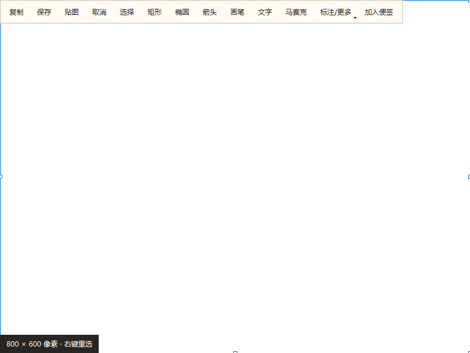

# 截图与贴图实现及验收记录

日期：2026-09-29（Asia/Shanghai）。证据目录使用 UTC，因此部分目录日期为 09-28。

本记录保留初次实现的验收结果；审查修复后的复验见下方「审查修复复验」。初次验收生成的测试包不包含后续修复。

适用范围更新：用户随后确定以 Snipaste 免费版的截图/贴图核心交互为目标。[设计和验收已更新到 v2](../research/2026-09-28-screenshot-core-design.md)，新增 UX01—UX10。本轮新增实现和专项结果见 [v2 验证记录](2026-09-29-screenshot-v2-results.md)。本记录的“双击全屏”、Shift 边界规则、关闭即释放以及六工具绘制等旧断言不代表 v2 正确行为；历史通过计数不等于 Snipaste 体验对标完成，原始证据保留不改写。

旧基线结论：C++/Qt 基础实现已经落地，本机专项和本地打包运行通过。硬件兼容矩阵、长时间压力及安装升级尚未完成，不能宣称旧 T01—T23 全条件或全部 Windows 平台验收通过。

## 代码与范围

- 按用户要求先提交原工作区：`f0ae1cf`，`chore: checkpoint current app changes before native capture implementation`。
- 截图重构是该提交之后的工作区修改，尚未再次提交；没有推送、打标签或发布。
- Windows x64：C++20、Qt 6.8.3 Widgets/Network；Electron 43.4.0；MSVC 19.51；Windows SDK 10.0.26100。
- 本机 Windows 11 build 26200，WMI 当前活动显示报告 NVIDIA GeForce RTX 5070、1920×1080。另有 AMD/远程虚拟显示驱动，未把其存在当作多显卡或远程桌面验收。
- 未逐档改变系统 DPI，不声称完成 100%—200% 及混合 DPI 矩阵。Qt 测试的逻辑尺寸变化仅证明坐标计算分支。
- 初次验收引擎 SHA256：`17B616ADA4C57D30BD3EB0668C95B052E1FF452BFF232F4F63BAAE35D3E52EDC`；审查修复后开发部署目录中的引擎已更新，见下方复验记录。

| 能力         | 实现位置/行为                                                                             |
| ------------ | ----------------------------------------------------------------------------------------- |
| C01 快捷键   | `CaptureShortcutService.js`，三项全局快捷键、托盘菜单、冲突/写入失败回滚、快捷键录制互斥  |
| C02 冻结画面 | `DesktopCapture.cpp` 按 HMONITOR 获取物理像素，全部屏幕捕获完成后才显示浮层               |
| C03 选区     | `CaptureOverlay.cpp`，反向框选、移动、八方向调整、1 像素方向键、F/双击全屏                |
| C04 屏幕/DPI | 每屏独立图像/窗口，以捕获像素为准；显示器新增/移除、几何/DPI 变化使旧会话失效             |
| C05 操作栏   | 屏内夹取，复制/保存/贴图/取消优先；其他工具可通过 Qt 溢出菜单访问                         |
| C06 标注     | 矩形、椭圆、箭头、画笔、文字、马赛克，颜色/线宽/字号，100 步撤销与重做                    |
| C07 输出     | 系统拥有的 DIBV5 剪贴板数据；PNG/JPEG 原子文件替换；保存取消/失败保留编辑现场             |
| C08 贴图     | `PinWindow.cpp`，移动、等比缩放、透明度、置顶、100%、复制/保存/关闭，支持图片及单文件来源 |
| C09 会话     | 多贴图独立、全体显隐/关闭确认、10 张/512 MiB 限额；退出清理                               |
| C10 业务     | 原便签截图入口/背景裁剪，以及全局独立图文草稿/背景；接收方 ACK 后才释放输出文件           |
| C11 生命周期 | 创建进程时原子加入 Job；IPC 断开退出；崩溃后下一次主动触发重启；草稿取消退出时不关闭引擎  |
| C12 交付     | 独立 DLL/EXE/Qt plugins、包内运行路径、结构化诊断、PNG 校验/编码工作线程，替换旧截图实现  |

全局默认按键：`Ctrl+Alt+A` 截图、`Ctrl+Alt+P` 剪贴板贴图、`Ctrl+Alt+H` 全部贴图显隐。均可在设置中修改或清空。便签完全退出后，这些按键和贴图一并退出；隐藏到托盘仍可用。

## 已运行的自动化

| 专项                                     | 最终结果                                        | 证据                                                                        |
| ---------------------------------------- | ----------------------------------------------- | --------------------------------------------------------------------------- |
| Vitest 15 个具名文件                     | **118 passed**，退出码 0                        | 下方列出文件与复现方法                                                      |
| 本次全部 JS/Vue 修改的 ESLint            | **passed**，无错误/警告                         | 最终命令退出码 0                                                            |
| electron-vite production build           | **passed**                                      | 生成 `out/main/capture-image.js`、主进程、preload、四个页面                 |
| CTest `capture_core`                     | **passed**，6 个 QtTest 结果（含 init/cleanup） | [core.txt](evidence/2026-09-29-capture-core/core.txt)                       |
| CTest `capture_ui`                       | **passed**，8 个 QtTest 结果（含 init/cleanup） | [ui.txt](evidence/2026-09-29-capture-core/ui.txt)                           |
| CTest `capture_clipboard`                | **passed**，5 个 QtTest 结果（含 init/cleanup） | [clipboard.txt](evidence/2026-09-29-capture-core/clipboard.txt)             |
| 真实 Electron 生命周期                   | **passed**                                      | [lifecycle.txt](evidence/2026-09-29-capture-core/lifecycle.txt)             |
| 真实键盘 + Electron 业务                 | **passed**                                      | [business.txt](evidence/2026-09-29-capture-core/business.txt)               |
| 默认合成图片业务运输模式                 | **passed**                                      | `tmp/test-runs/2026-09-28T17-17-30-331Z-4aL3hV/`                            |
| Windows 本地解包构建及 ASAR/原生依赖检查 | **passed**                                      | `tmp/capture-package-20260929/win-unpacked/`，`--publish never`             |
| 实际打包应用截图/草稿/退出               | **passed**                                      | [package-result.json](evidence/2026-09-29-capture-core/package-result.json) |

真实 Electron 最终证据：`tmp/test-runs/2026-09-28T17-15-58-576Z-JOTfS0/`。
打包运行最终证据：`tmp/test-runs/capture-package-FLydgS/`。

15 个 Vitest 文件：`capture-shortcut`、`capture-assets`、`capture-coordinator`、`capture-recorder-owner`、`capture-image-worker`、`settings-schema`、`application-settings`、`view-visibility-shortcut`、`view-visibility-shortcut-service`、`diagnostic-noise-and-location`、`test-manifest`、`view-visibility-shortcut-ui`、`dock-main-wiring`、`settings-panel-density`、`package-native-config`（均为 `tests/<名称>.test.js`）。另在此前一轮已运行 `view-visibility-shortcut-electron.mjs`，验证既有视图快捷键专项。

关键业务断言：

- 全局截图无需打开新建表单，实际 Qt 键盘操作可以创建独立草稿；同一草稿内部继续截图得到第二张附件。
- 放弃草稿必须确认；请求应用退出后选择“继续编辑”，引擎 PID 保持、快捷键仍注册，并可继续截图。
- 全局背景截图进入现有裁剪器；取消裁剪不应用背景。
- 页面导航、崩溃或销毁会使接收来源失效；负 ACK 恢复原截图，不把旧结果交给新页面。
- 真实底图在等待后保持一致；负 ACK 后底图和选区恢复；支持再贴图及显隐。
- 单张资源/格式校验、贴图 10 张/512 MiB 上限、100 步撤销、窄至 240 个逻辑像素时主要操作可见。
- 关闭最后一张贴图后计数回到零，可继续创建；保存窗口取消以及保存时会话被取消不会访问旧窗口。
- 实际终止测试自己创建的主进程，截图子进程被 Job 回收；IPC 断开、引擎故障和正常退出均收敛。
- 剪贴板测试运行在独立 Windows window station：透明像素往返、PNG-only 来源、窗口销毁后数据仍有效、占用失败都通过，没有替换用户桌面剪贴板。
- 打包应用运行时删除 Qt 开发 PATH/插件环境变量；确认从包内资源加载引擎，ASAR 内的图像工作线程能够校验真实截图，便签收到图片，应用退出后无引擎残留。



## 审查修复复验

2026-09-29 修复两处 P1：

- 绘制中按 Esc / 右键取消后，统一清空当前标注、拖动和文字输入状态；提交标注也结束当前拖动，覆盖按住左键时撤销或选择全屏的相同风险。
- 原生浮层的 `closeEvent` 接入取消回调。引擎先清空会话再关闭全部浮层，避免关闭回调重复结束；既有贴图继续保留。

新增回归覆盖五种拖动标注 × 四种中断方式（Esc、右键、撤销、全屏），检查左键未松开时继续移动、松开后再次绘制。另覆盖双浮层清理、待交付状态清理、贴图保留、成功输出状态不被取消覆盖，以及系统关闭后的新截图。

| 本轮验证 | 结果 | 证据 |
| --- | --- | --- |
| `native_capture/build.ps1` 原生构建及开发部署 | passed；Qt 翻译路径警告仍存在 | 当前引擎 SHA256 见下 |
| CTest `capture_ui` | **29 passed，0 failed，0 skipped**（含 init/cleanup） | [review-fix-ui.txt](evidence/2026-09-29-capture-core/review-fix-ui.txt) |
| `tests/capture-coordinator.test.js` | **8 passed** | Vitest 退出码 0 |
| `tests/capture-business-electron.mjs` ESLint | passed | 退出码 0 |
| Electron 截图生命周期专项 | passed | [review-fix-lifecycle.txt](evidence/2026-09-29-capture-core/review-fix-lifecycle.txt) |
| Electron 真实输入业务专项 | passed；实际 Alt+F4 关闭后会话释放、主窗口恢复、引擎 PID 不变，后续便签和背景截图交付成功 | [review-fix-business.txt](evidence/2026-09-29-capture-core/review-fix-business.txt) |

Electron 证据目录：`tmp/test-runs/2026-09-29T01-38-00-509Z-G64GpC/`。

修复后 `native_capture/deploy/AbandonCapture.exe` SHA256：`7F306DE90A7CF988EDD2F61619D0382407F76E2DD9A5415C07A21415F9F6509C`。

首轮新增系统关闭测试在 Windows 关闭事件处理前立即断言，提前失败后遗留测试回调导致后续测试崩溃；改为等待 Qt 处理关闭事件，并添加测试夹具退出清理后，同一 UI 专项最终全部通过。该轮失败不计为通过。

复现命令（PowerShell；原生窗口与 Electron 命令须在可访问桌面的环境执行）：

```powershell
$env:PATH = 'C:\Users\Admin\.cache\codex-runtimes\codex-primary-runtime\dependencies\node\bin;' + $env:PATH
& 'C:\Users\Admin\.cache\codex-runtimes\codex-primary-runtime\dependencies\node\bin\node.exe' node_modules/vitest/vitest.mjs run tests/capture-coordinator.test.js
powershell -NoProfile -ExecutionPolicy Bypass -File native_capture/build.ps1
$env:PATH = "$pwd/tmp/toolchains/qt/6.8.3/msvc2022_64/bin;$env:PATH"
$env:QT_PLUGIN_PATH = "$pwd/tmp/toolchains/qt/6.8.3/msvc2022_64/plugins"
& 'C:\Program Files\Microsoft Visual Studio\18\Community\Common7\IDE\CommonExtensions\Microsoft\CMake\CMake\bin\ctest.exe' --test-dir native_capture/build -C Release -R '^capture_ui$' --output-on-failure
$env:ABANDON_CAPTURE_REAL_INPUT = '1'
& 'C:\Users\Admin\.cache\codex-runtimes\codex-primary-runtime\dependencies\node\bin\node.exe' scripts/run-electron-window-tests.cjs capture
```

本轮仅修改原生浮层、相关回归测试和测试文档。未运行全量回归，未重新打包或验证安装升级；真实多屏/混合 DPI、Windows 10、长时间压力条件仍未覆盖。双浮层用例使用单屏上的两个合成窗口，不等同于真实双屏验收。

## T01—T23 覆盖台账

`passed / not-run` 表示列出的子项已通过，整组仍有尚未执行的条件。没有用子项结果替代整组完整验收。

| 用例 | 状态                       | 本次覆盖与剩余条件                                                                                               |
| ---- | -------------------------- | ---------------------------------------------------------------------------------------------------------------- |
| T01  | passed / not-run           | 注册、应用内重复/系统占用、回滚、清空与配置逻辑通过；另一外部进程占用及全部按键重启矩阵未逐项执行                |
| T02  | passed / not-run           | 主进程暂停/恢复，录制所有权串行切换通过；四个 UI 控件逐一真实按键及全部视图 IME 录制未全验                       |
| T03  | passed / not-run           | 单宿主并发预热、单会话、失败后重试通过；灵动岛/贴边/托盘全部组合未全验                                           |
| T04  | passed / not-run           | 先捕获后浮层、底图不变、输出裁切一致；带递增帧号动态窗口的 3 秒基准未执行                                        |
| T05  | passed                     | 反向框选、半开裁切、1 像素边界、八向调整、方向键、全屏、输出尺寸通过                                             |
| T06  | passed / not-run           | 非等同逻辑尺寸下的物理像素微调通过；真实系统各 DPI 档位未执行                                                    |
| T07  | blocked                    | 缺少本轮真实混合 DPI/左侧副屏/竖屏设备配置；不能以模拟尺寸代替                                                   |
| T08  | passed / not-run           | 四边定位算法、Qt 全屏和窄屏主要按钮可见，附合成窗口图；复杂背景/所有大缩放/Tab 导航尚未逐项实操                  |
| T09  | passed / not-run           | 六工具、中文多行文本提交、撤销重做和合成像素通过；颜色/字号对话框的全部真实交互待人工验收                        |
| T10  | passed / not-run           | Qt IME commit 事件、多行及撤销通过；真实微软拼音候选、组合期间 Ctrl+C/Esc 全序列待人工验收                       |
| T11  | passed / not-run           | 隔离剪贴板原图透明像素、复制窗口销毁后数据有效及占用失败通过；退出整个应用后在画图粘贴尚未实操                   |
| T12  | passed / not-run           | PNG/JPEG/透明区域合成、写失败、取消保存、对话框期间取消会话通过；磁盘满/系统覆盖确认故障注入未执行               |
| T13  | passed                     | 单接收者 ACK、过期结果、来源重载/退出、预热期来源失效、失败可重试与一次恢复通过                                  |
| T14  | passed / not-run           | 截图贴图、DIBV5/PNG-only、文件格式 PNG/JPEG/BMP/WebP 读取通过；各格式文件从真实资源管理器复制再贴图未逐一操作    |
| T15  | passed / not-run           | 原图独立、显隐保持位置、透明显示不改原图、Esc 关闭通过；拖动/置顶/透明度/关闭全部确认菜单全流程尚待人工验收      |
| T16  | passed / not-run           | 取消退出保留引擎/快捷键、真实父进程异常、正常退出、IPC 断开通过；带 3 张贴图的全部退出组合未全验                 |
| T17  | passed / not-run           | 观察到锁屏使真实输入前提不成立；解锁后重跑通过，并加入新截图锁屏检查；主动截图中锁屏、睡眠、物理热插拔未执行     |
| T18  | not-run                    | 本轮列表视图主路径恢复通过；章程规定的 18 组视图/层级/隐藏矩阵未执行                                             |
| T19  | passed / not-run           | 10 张数量、512 MiB 逻辑预算、关闭释放和 101+ 步历史通过；100 轮 4K RSS/GDI/USER 压力、分配失败未执行             |
| T20  | passed / not-run           | 全局独立草稿、同草稿二次截图、放弃保护通过；已有便签保存/取消、月视图及全部附件上限组合未全验                    |
| T21  | passed / not-run           | 全局背景接入及取消通过；背景设置入口代码复用接收器，实际确认保存/存储失败和毛玻璃切换组合未全验                  |
| T22  | passed / not-run           | 资产目录约束、PNG CRC/尺寸/损坏、旧会话、引擎崩溃恢复通过；所有非法管道握手/外层 Job 限制注入尚未执行            |
| T23  | passed / blocked / not-run | 当前机器本地包/包内 Qt/ASAR worker/截图退出通过；干净 Windows 10/11、安装升级、长期共存和 p50/p95 性能基准未执行 |

## 失败、修复和限制

- 早期物理输入阶段桌面为 LockApp，属于前提不成立。用户解锁后真实业务断言通过，不能把此前锁屏尝试当作产品测试通过。
- 新增贴图预算测试发现 `destroyed` 发出时最后一个 `QPointer` 可能尚未清空，导致残留计数。按窗口指针显式移除后重跑通过。
- 隔离剪贴板测试发现经 Qt 中转的半透明像素可能发生预乘舍入；常见 32 位 DIBV5 改为直接读取，像素比对通过。占用测试使用另一窗口持有剪贴板，验证失败不报告成功。
- 包内运行测试第一次过早附加 Electron 临时启动上下文，Inspector 返回 `Promise was collected`。延后到启动上下文稳定后复测通过，此次是测试控制时序修正。
- Qt 的部署工具在本地中文路径下报告翻译路径警告；原生依赖检查和无开发 PATH 的运行通过。本次没有部署额外 Qt 翻译包，原生自定义文案为中文，系统文件对话框跟随 Windows。
- Windows 对外部应用焦点的恢复采用窗口关闭后的系统行为，主视图显隐/焦点另有宿主恢复。未承诺绕过系统前台限制。
- 本轮未执行完整项目回归：没有运行 `npm test`、`npm run test:window-frame:win` 或全量测试脚本。
- 本地构建为 `--dir` 验收包；没有运行安装器、发布工作流或更新替换。第三方许可证/对应源码交付及正式发布所需检查应在授权发布阶段再复核。
- HDR/广色域、受保护视频/UAC 安全桌面、独占全屏、远程桌面、多显卡驱动兼容仍无支持保证。

## 可复现命令

在仓库根目录执行。真实 Qt/Electron/打包专项需正常桌面资源与沙箱外运行；真实输入模式需先解锁 Windows。

```powershell
$taskNodeDir = 'C:\Users\Admin\.cache\codex-runtimes\codex-primary-runtime\dependencies\node\bin'
$taskNode = Join-Path $taskNodeDir 'node.exe'
$env:PATH = "$taskNodeDir;$env:PATH"

powershell -NoProfile -ExecutionPolicy Bypass -File native_capture/build.ps1 -Test
& $taskNode node_modules/electron-vite/bin/electron-vite.js build

$env:ABANDON_CAPTURE_REAL_INPUT = '1'
& $taskNode scripts/run-electron-window-tests.cjs capture

& $taskNode node_modules/electron-builder/cli.js --config electron-builder.win.yml --win --x64 --dir --publish never --config.directories.output=tmp/capture-package-20260929
& $taskNode tests/capture-package-smoke.cjs tmp/capture-package-20260929/win-unpacked
```

局部逻辑测试采用上面列出的 15 个具名文件，使用 `node_modules/vitest/vitest.mjs run <文件...>`，不要用 changed/related 代替具名清单。新增 native 和 Qt 工具目录、构建产物、测试包位于 Git 忽略目录；源码、测试和此记录可正常提交。
