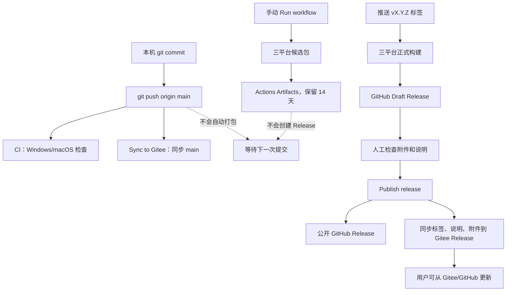

# Abandon Note 发布、构建与应用更新流程

本文档对应以下仓库和当前配置：

- GitHub 主仓库：<https://github.com/feimingabandon/abandon_note2>
- Gitee 镜像及国内下载仓库：<https://gitee.com/zou-feiming/abandon_note2>
- 主分支：`main`
- 当前版本：`0.9.0`
- Windows：x64 NSIS 安装包
- macOS：Intel x64 DMG、Apple 芯片 arm64 DMG
- 发布通道：只使用稳定版，不使用 `-beta`、`-alpha` 等后缀

## 1. 先说结论：当前流程完成到哪里

| 环节 | 当前状态 | 说明 |
| --- | --- | --- |
| 普通代码推送后运行 Windows/macOS CI | 已真实跑通 | 两个平台的 CI 均成功 |
| GitHub `main` 自动同步到 Gitee `main` | 已真实跑通 | 两边提交号一致 |
| 手动运行三平台候选包构建 | 已真实跑通 | Windows x64、macOS x64、macOS arm64 均成功 |
| 本地 Windows NSIS 实际打包 | 已真实跑通 | C++ DLL 已进入安装包 |
| 应用内版本检测和 Windows 全量下载 | 已实现并通过自动测试 | 尚无公开 Release，因此还不能用真实新版本做端到端更新 |
| 推送版本标签后自动生成 GitHub Draft Release | 配置已完成，未做首次真实标签发布 | 需要第一次 `v0.9.0` 标签来验证 |
| 正式发布 GitHub Release 后同步附件到 Gitee Release | 配置已完成，尚未真实发布验证 | 只有点击 GitHub 的“发布版本（Publish release）”后才会触发 |

所以，“日常提交和主分支同步”已经跑完；“第一次真实 Release 和 Release 附件同步”还没有跑。

## 2. 最重要的概念：提交不等于推送，推送不等于发布

- `git commit`：只在本机生成一个提交，不会触发 GitHub 的任何功能。
- `git push origin main`：提交到达 GitHub `main` 后，才会触发普通 CI 和 Gitee 主分支同步。
- 推送普通代码不会生成安装包，也不会发布版本。
- 手动运行候选构建只生成供测试的临时文件，不会创建 Release。
- 推送与 `package.json` 版本一致的 `v*` 标签，才会生成 Draft Release。
- Draft Release 不公开，也不会同步到 Gitee Release。
- 最后点击“发布版本（Publish release）”，才算 GitHub 正式发布，并触发 Gitee Release 同步。



## 3. 普通开发：代码推到 GitHub 后会发生什么

### 3.1 什么动作会触发

以下任一动作会触发 `CI`：

- 向 GitHub `main` 推送提交；
- 创建或更新一个目标为 `main` 的 Pull Request；
- 在 GitHub 网页上手动运行 `CI`。

只有“向 `main` 推送提交”会同时触发 Gitee 主分支同步。Pull Request 不会提前同步到 Gitee。

原因在 `.github/workflows/ci.yml` 和 `.github/workflows/sync-gitee.yml` 的触发条件：

- `push -> branches -> main`
- `pull_request -> branches -> main`

### 3.2 GitHub 页面上在哪里看

1. 打开 GitHub 仓库。
2. 点击顶部“操作（Actions）”。
3. 左侧会看到：
   - `CI`
   - `Sync to Gitee`
   - `Build release candidates`
4. 点击 `CI`，打开本次运行记录。
5. 页面中应看到两个任务：
   - `Verify (windows-latest)`
   - `Verify (macos-14)`
6. 两个任务都显示绿色对勾“成功（Success）”，普通 CI 才算通过。

### 3.3 CI 实际执行了什么

Windows 和 macOS 分别在干净的 GitHub 运行器上执行：

1. “签出仓库（Check out repository）”
   - 下载本次提交的代码。
2. “设置 Node.js（Set up Node.js）”
   - 使用 Node.js `22.22.3`。
3. “安装依赖（Install dependencies）”
   - 执行 `npm ci`，严格按照 `package-lock.json` 安装。
4. “代码检查（Lint）”
   - 执行 `npm run lint`。
5. “测试（Test）”
   - 执行 `npm test`。
6. “构建应用（Build application）”
   - 执行 `npm run build`，编译 Electron 主进程、preload 和 Vue renderer。

注意：普通 `CI` 的最后一步只是编译检查，不生成可安装的 EXE 或 DMG。

### 3.4 为什么普通提交不会打包

打包工作流 `Build release candidates` 只接受两种触发：

- 人工点击“运行工作流（Run workflow）”；
- 推送名为 `v*` 的 Git 标签。

它没有监听普通的 `main` push。因此可以频繁提交代码，不会每次都浪费时间生成三套安装包。

不需要为了避免自动打包而专门创建 `test` 分支。

如果以后使用功能分支：

- 只向功能分支 push：当前不会运行 `CI`；
- 从功能分支创建目标为 `main` 的 Pull Request：会运行 `CI`；
- 合并到 `main`：再次运行 `CI`，并同步 Gitee `main`。

## 4. GitHub 的 `main` 怎么自动同步到 Gitee

普通代码到达 GitHub `main` 后，`Sync to Gitee` 工作流的 `Mirror main branch to Gitee` 任务开始运行：

1. “签出完整历史（Check out complete history）”
   - 使用 `fetch-depth: 0` 获取完整 Git 历史。
2. “验证仓库 API 访问（Verify repository API access）”
   - 从 GitHub 仓库 Secret 读取 `GITEE_TOKEN`。
   - 调用 Gitee API，确认令牌能访问 `zou-feiming/abandon_note2`。
3. “推送 main 到 Gitee（Push main to Gitee）”
   - 添加 Gitee Git 远程地址。
   - 通过临时 HTTP Authorization Header 使用用户名和令牌。
   - 将当前 GitHub 提交推送到 Gitee 的 `refs/heads/main`。

`GITEE_TOKEN` 只保存在 GitHub：

1. GitHub 仓库“设置（Settings）”
2. “机密和变量（Secrets and variables）”
3. “操作（Actions）”
4. “仓库机密（Repository secrets）”
5. Secret 名称：`GITEE_TOKEN`

令牌不会写进应用，也不会发给最终用户。

查看同步结果：

1. GitHub 仓库 → “操作（Actions）”
2. 左侧点击 `Sync to Gitee`
3. 打开对应运行记录
4. `Mirror main branch to Gitee` 应为“成功（Success）”
5. 再打开 Gitee 的 `main` 分支，确认最新提交号与 GitHub 相同

如果 GitHub 和 Gitee 的 `main` 被分别修改导致历史分叉，安全推送会失败，不会强制覆盖 Gitee。此时需要先人工判断两边改动，不能直接强推。

## 5. 只想先测试安装包：手动候选构建

这一步适合发布前让 Windows 10、Windows 11 和 macOS 测试人员试用。

### 5.1 网页按钮的精确位置

1. GitHub 仓库 → 顶部“操作（Actions）”
2. 左侧点击 `Build release candidates`
3. 点击右侧“运行工作流（Run workflow）”
4. 在“使用工作流来自（Use workflow from）”或分支下拉框中选择 `main`
5. 点击绿色“运行工作流（Run workflow）”

GitHub 会创建一条新的运行记录。

### 5.2 会生成什么

工作流会并行生成：

- `abandon-note-windows-x64`
  - Windows x64 NSIS 安装包
  - `.blockmap`
  - `latest.yml`
- `abandon-note-macos-x64`
  - Intel Mac DMG
- `abandon-note-macos-arm64`
  - Apple 芯片 Mac DMG

这些文件出现在本次 Actions 运行页面底部的“构件（Artifacts）”区域。点击构件名称会下载一个 ZIP。

构件只保留 14 天。

### 5.3 C++ 是否会一起编译

Windows 会：

1. “编译 Windows 模糊引擎（Compile Windows blur engine）”
   - 执行 `npm run build:native:win`。
2. “验证模糊引擎（Verify blur engine）”
   - 确认 `native_blur/build/bin/blur_engine.dll` 存在。
3. electron-builder 将 DLL 放到安装包的 `resources/native_blur/`。

macOS 不编译这个 Windows DLL。macOS 使用系统原生 Vibrancy，不依赖 `blur_engine.dll`。

### 5.4 手动候选构建不会做什么

- 不创建 Git 标签；
- 不创建 Draft Release；
- 不公开发布；
- 不同步 Gitee Release；
- 不会让现有客户端检测到新版本。

因为工作流中的 `Create GitHub Draft Release` 有条件：

```text
if: github.event_name == 'push'
```

手动按钮产生的是 `workflow_dispatch` 事件，所以 Draft 步骤会跳过。

## 6. 正式版本发布：从改版本号到 Gitee 可下载

下面用发布 `0.9.1` 举例。发布其他版本时替换所有版本号。

### 6.1 发布前准备

1. 确认准备发布的代码已经合入 `main`。
2. 修改 `package.json` 和 `package-lock.json` 中的版本：

```powershell
npm version 0.9.1 --no-git-tag-version
```

3. 本地至少运行：

```powershell
npm run lint
npm test
npm run build
```

4. Windows 发布前建议再运行：

```powershell
npm run build:win
```

5. 提交并推送版本号：

```powershell
git add package.json package-lock.json
git commit -m "chore: prepare v0.9.1"
git push origin main
```

6. 在 GitHub → “操作（Actions）”中等待 `CI` 和 `Sync to Gitee` 成功。

### 6.2 可选：先构建一次候选包

按照第 5 节点击：

`Actions` → `Build release candidates` → `Run workflow` → `main` → `Run workflow`

下载三个构件交给测试人员。确认主要功能、安装位置选择、覆盖安装、数据保留以及 macOS 打开方式。

### 6.3 创建并推送版本标签

确认测试通过后：

```powershell
git switch main
git pull --ff-only origin main
git tag -a v0.9.1 -m "Abandon Note v0.9.1"
git push origin v0.9.1
```

标签必须满足：

```text
Git 标签 = v + package.json 版本
```

例如：

- `package.json` 是 `0.9.1`
- 标签必须是 `v0.9.1`

如果不一致，`Validate release version` 会失败，防止安装包内部版本和 Release 名称对不上。

### 6.4 标签推送后自动执行什么

`Build release candidates` 会自动运行：

1. `Validate release version`
2. `Windows x64`
3. `macOS x64`
4. `macOS arm64`
5. 前三个系统构建全部成功后，运行 `Create GitHub Draft Release`

Windows 产物：

- `Abandon-Note-0.9.1-windows-x64-setup.exe`
- `Abandon-Note-0.9.1-windows-x64-setup.exe.blockmap`
- `latest.yml`

macOS 产物：

- `Abandon-Note-0.9.1-macos-x64.dmg`
- `Abandon-Note-0.9.1-macos-arm64.dmg`

最后还会生成：

- `SHA256SUMS.txt`

因此正常的 Draft Release 应有 6 个附件。

### 6.5 Draft Release 是什么

Draft 是“发布草稿”：

- 仓库管理员可见；
- 普通用户看不到；
- 应用的更新检查读不到；
- 不会触发 Gitee Release 同步；
- 可以修改标题、说明和附件；
- 可以删除后重新构建，不影响用户。

GitHub 页面查看方法：

1. 仓库首页右侧点击“版本（Releases）”，或打开顶部/侧边的 Releases 页面
2. 找到带“草稿（Draft）”标记的版本
3. 点击“编辑（Edit）”
4. 检查标签、标题、发行说明和 6 个附件

发布前至少确认：

- 标签是 `v0.9.1`
- 标题是 `Abandon Note v0.9.1`
- EXE、两个 DMG 均存在
- 文件大小不是 0
- `SHA256SUMS.txt` 存在
- 下载并测试的安装包来自这次 Draft，而不是旧的 Actions 构件

### 6.6 正式发布按钮

在 Draft 编辑页面：

1. “设为预发布版（Set as a pre-release）”：不要勾选
2. “设为最新版本（Set as the latest release）”：保持勾选或默认最新
3. 点击“发布版本（Publish release）”

点击后：

- GitHub Release 立即公开；
- GitHub 的 `/releases/latest` 开始返回该版本；
- `Sync to Gitee` 收到 `release: published` 事件；
- Gitee Release 同步任务开始。

“发布版本（Publish release）”是对外发布动作。点击前必须确认附件和说明。

## 7. 正式 Release 怎么同步到 Gitee

GitHub Release 发布后，`Sync published Release to Gitee` 执行：

1. “验证 Gitee 访问（Verify Gitee access）”
   - 使用 `GITEE_TOKEN` 验证目标仓库。
2. “镜像 Release 标签到 Gitee（Mirror release tag to Gitee）”
   - 将同名标签，例如 `v0.9.1`，推送到 Gitee。
3. “下载 GitHub Release 附件（Download GitHub Release assets）”
   - 将 GitHub Release 的全部附件下载到运行器临时目录。
4. “准备发布元数据（Prepare release metadata）”
   - 读取 GitHub Release 标题和发行说明。
5. “同步 Gitee Release（Synchronize Gitee Release）”
   - 按标签查询 Gitee 是否已有 Release。
   - 没有则创建；已有则更新标题和说明。
   - 查询 Gitee 现有附件。
   - 对同名附件先删除旧文件，再上传 GitHub 的最新文件。

最终 Gitee 应具有：

- 相同标签；
- 相同发布标题；
- 相同发行说明；
- 相同的 6 个附件。

查看方法：

1. GitHub → “操作（Actions）”
2. 左侧 `Sync to Gitee`
3. 打开由 Release 触发的运行记录
4. `Sync published Release to Gitee` 必须为“成功（Success）”
5. 打开 Gitee 仓库 → “发行版（Releases）”
6. 确认版本、说明和附件
7. 实际下载一个文件，确认链接可用

如果同步失败：

1. 不要重新点击 GitHub 的 Publish；
2. 打开失败的 `Sync to Gitee` 运行记录；
3. 点击“重新运行任务（Re-run jobs）”；
4. 点击“重新运行失败的任务（Re-run failed jobs）”；
5. 再检查 Gitee Release。

同步脚本会更新同标签 Release，并替换同名附件，不会故意创建一堆重复附件。

## 8. 怎样才算“打包完成”和“发布完成”

三个概念不要混用：

### 8.1 候选包完成

- 手动 `Build release candidates` 成功；
- 三个 Actions Artifacts 可下载。

这只代表“可以测试”，不代表用户能看到。

### 8.2 GitHub 打包完成

- 推送版本标签；
- `Build release candidates` 全部成功；
- Draft Release 出现；
- 6 个附件齐全。

这代表“正式安装包已经生成”，但仍未公开。

### 8.3 完整发布完成

- 人工测试 Draft 附件；
- 点击 `Publish release`；
- GitHub Release 公开；
- `Sync published Release to Gitee` 成功；
- Gitee Release 的版本、说明、附件检查通过；
- Windows 和两种 Mac 至少各完成一次下载/打开测试。

只有做到这里，才算 GitHub 和 Gitee 双平台发布完成。

## 9. 首次发布 `v0.9.0` 的特殊情况

当前应用内部版本已经是 `0.9.0`。

发布 `v0.9.0` 后：

- 尚未安装的用户可以下载并安装首个公开版本；
- 已运行 `0.9.0` 的测试用户检查更新时会看到“已经是最新版本”；
- 不会弹出“发现新版本”，因为线上 `0.9.0` 不大于本机 `0.9.0`。

要真实验证“从旧版发现新版并在线下载”，需要之后发布 `0.9.1`，并使用仍安装 `0.9.0` 的 Windows 电脑测试。

## 10. 应用更新模块的完整逻辑

### 10.1 检查从哪里开始

有两个入口：

#### 启动静默检查

应用 renderer 初始化完成约 1.2 秒后自动检查。

- 有新版：弹出更新窗口。
- 已是最新版：不打扰用户。
- 网络或 Release 不存在：不自动弹错误窗口。

#### 手动检查

应用内：

1. 点击右上角“设置”
2. 滚动到“关于”
3. 点击“检查更新”

手动检查一定会打开更新窗口，因此用户可以看到：

- 正在检查；
- 发现新版本；
- 已经是最新版本；
- 暂时无法检查更新。

### 10.2 去哪里查询版本

查询顺序固定：

1. Gitee：
   - `https://gitee.com/api/v5/repos/zou-feiming/abandon_note2/releases/latest`
   - 再调用 Gitee Release 附件列表接口。
2. 如果 Gitee 失败，再查询 GitHub：
   - `https://api.github.com/repos/feimingabandon/abandon_note2/releases/latest`

客户端只访问公开 API，不包含 `GITEE_TOKEN` 或 GitHub Token。

### 10.3 什么版本会被接受

只接受稳定数字版本：

```text
数字.数字.数字
```

例如：

- 接受：`v0.9.1`、`1.0.0`
- 拒绝：`0.9.1-beta.1`、`1.0.0-alpha`、`latest`

Draft 和 prerelease 也会被忽略。

### 10.4 怎么判断新旧

先去掉开头的 `v`，再逐段按数字比较：

- `0.10.0` 大于 `0.9.9`
- `1.0.0` 等于 `1.0.0`
- `0.8.9` 小于 `0.9.0`

结果分为：

| 状态 | 条件 | 界面行为 |
| --- | --- | --- |
| `available` | 线上版本大于本机版本 | 显示“发现新版本” |
| `current` | 线上版本等于或小于本机版本 | 显示“已经是最新版本 / 当前无需下载任何安装包” |
| `error` | Gitee 和 GitHub 都无法返回有效稳定版本 | 显示错误，但保留手动地址 |

应用不会因为线上返回了更旧版本就提供降级按钮。

### 10.5 怎么判断当前系统应下载什么

安装包名称必须精确匹配：

- Windows x64：
  - `Abandon-Note-<版本>-windows-x64-setup.exe`
- macOS Intel：
  - `Abandon-Note-<版本>-macos-x64.dmg`
- macOS Apple 芯片：
  - `Abandon-Note-<版本>-macos-arm64.dmg`

更新窗口始终显示当前系统应该下载的文件名。

### 10.6 Windows 界面和行为

发现新版本且 Release 中存在准确的 Windows EXE 时：

- 显示“在线下载更新”；
- 显示 Gitee 下载；
- 显示 GitHub 下载；
- 显示准确的 EXE 文件名。

在线下载过程：

1. 优先使用返回有效 Release 的来源；正常情况下是 Gitee。
2. 保存到系统临时目录下的 `abandon-note-updates`。
3. 下载中先写入 `<安装包>.part`，避免半个文件被当成完整安装包。
4. 显示下载进度。
5. 如果相同安装包已经存在：
   - 校验文件大小；
   - 如果 Release 有 `SHA256SUMS.txt`，再校验 SHA-256；
   - 校验通过则直接复用，不重复下载；
   - 校验失败则删除并重新下载。
6. 新下载完成后：
   - 校验大小；
   - 有 SHA-256 时校验哈希；
   - 校验通过后将 `.part` 原子改名为正式 EXE。
7. 按钮变为“安装更新并退出”。
8. 点击后用 Windows 打开安装包，并在约 350 毫秒后退出 Abandon Note。

这是半自动更新，不是静默安装：

- 应用负责检测和下载；
- 用户明确点击后才启动安装器；
- NSIS 安装器仍会显示安装步骤；
- 用户不需要先手动卸载；
- 用户数据不会被更新模块主动删除。

### 10.7 macOS 界面和行为

macOS 不显示在线安装按钮。

更新窗口只显示：

- Gitee 下载；
- GitHub 下载；
- Intel 或 Apple 芯片对应的准确 DMG 文件名。

用户下载 DMG 后按 macOS 常规方式安装。因为当前 macOS 包没有购买签名和公证，系统可能显示来源或安全提醒。

### 10.8 网络和下载失败

无论在线更新是否可用，窗口始终保留：

- “Gitee 下载”
- “GitHub 下载”
- 当前系统安装包名称

因此：

- Gitee API 失败：尝试 GitHub API；
- 两者都失败：显示错误和两个手动发布页；
- 在线下载失败：显示错误，用户可改用手动地址；
- Release 中缺少正确 EXE：不显示在线下载，保留手动地址。

### 10.9 安全边界

- renderer 不能提交任意下载 URL；
- renderer 不能指定任意本地文件路径；
- 仓库地址、文件名规则和临时目录都由主进程控制；
- renderer 只通过受限 preload API 请求“检查、下载、安装、打开 Gitee/GitHub”；
- 主进程只接受主窗口发来的更新 IPC；
- 下载进度发给 renderer 时会移除本机文件路径。

## 11. `allowDowngrade` 到底是什么

`allowDowngrade` 的含义是“是否允许自动更新器安装比当前版本更旧的版本”。

但它不是当前 `electron-builder.yml` 的 NSIS 配置项。

它属于 `electron-updater` 的运行时 `autoUpdater` 属性，例如其他项目可能写：

```javascript
autoUpdater.allowDowngrade = false
```

把下面内容写进本项目的 `electron-builder.yml`：

```yaml
nsis:
  allowDowngrade: false
```

会被 electron-builder `26.15.3` 判定为无效配置，并直接终止打包。因此本项目没有保留这个无效键。

当前自定义更新模块的处理是：

- 只有 `线上版本 > 本机版本` 时才显示在线下载；
- 线上版本等于或小于本机版本时显示“无需更新”；
- 所以应用内更新入口不会主动降级。

限制是：如果用户自己保留并双击一个旧 EXE，这已经绕过应用更新模块。若以后必须严格阻止手动降级，需要编写和测试自定义 NSIS 版本检查脚本，不能靠 `electron-builder.yml` 中不存在的选项。

## 12. 为什么不需要 `electron-updater`

`electron-updater` 是一套通用自动更新框架，通常负责：

- 读取 `latest.yml` 等更新元数据；
- 按 provider 访问 GitHub、S3 或 generic 更新服务器；
- 下载更新；
- 支持自动安装及部分差分更新流程；
- 通过 `autoUpdater` 事件上报状态。

本项目的需求更具体：

- Gitee 是国内优先下载源；
- GitHub 是构建和发布源；
- Gitee 失败时才回退 GitHub；
- Windows 只做用户点击触发的全量半自动更新；
- macOS 只做手动更新；
- 无论成功失败都要显示 Gitee/GitHub 双链接；
- 必须明确告诉用户当前系统应下载哪个文件；
- 不做差分下载；
- 不自建更新服务器。

直接使用 `electron-updater` 反而仍需大量自定义 provider、来源回退和 UI 逻辑。现在的 `AppUpdateService` 已经直接实现所需行为，因此删除了未使用的 `electron-updater` 依赖，避免：

- 让人误以为当前应用使用它自动更新；
- 同时存在两套更新状态机；
- 增加不必要的生产依赖；
- 将来错误地启用自动安装或差分逻辑。

当前 Release 仍会生成 `.blockmap` 和 `latest.yml`，因为 electron-builder 会产出它们，工作流也暂时保留：

- 当前自定义更新模块不读取它们；
- 当前 Windows 下载是完整 EXE；
- `.blockmap` 不参与差分下载；
- `latest.yml` 不负责当前版本判断；
- 保留它们便于将来改变方案，也方便检查构建元数据。

真正被当前更新模块使用的是：

- Gitee/GitHub Release API；
- 精确命名的 EXE/DMG；
- Release 附件大小；
- `SHA256SUMS.txt`。

## 13. 每次发布的最短检查清单

### 日常提交

- [ ] `git push origin main`
- [ ] GitHub `CI`：Windows 成功
- [ ] GitHub `CI`：macOS 成功
- [ ] `Sync to Gitee`：Mirror main 成功
- [ ] GitHub/Gitee `main` 提交号一致

### 发布前

- [ ] 更新 `package.json` 和 `package-lock.json` 版本
- [ ] lint、测试、build 通过
- [ ] Windows 本地 NSIS 打包通过
- [ ] 候选包完成 Windows 10、Windows 11、macOS 测试

### 生成正式安装包

- [ ] 创建 `vX.Y.Z` 标签
- [ ] 标签与 `package.json` 完全匹配
- [ ] 推送标签
- [ ] `Build release candidates` 全部成功
- [ ] Draft Release 有 6 个附件
- [ ] `SHA256SUMS.txt` 存在

### 对外发布

- [ ] Draft 标题和说明检查完成
- [ ] 不勾选 `Set as a pre-release`
- [ ] 点击 `Publish release`
- [ ] GitHub Release 可公开下载
- [ ] `Sync published Release to Gitee` 成功
- [ ] Gitee Release 的标签、说明和附件齐全
- [ ] Gitee/GitHub 至少各测试一个下载链接
- [ ] 旧版本 Windows 实机能发现新版并完成全量下载
- [ ] macOS Intel/Apple 芯片显示正确 DMG 名称

## 14. 相关实现文件

- 普通 CI：`.github/workflows/ci.yml`
- 构建和 Draft Release：`.github/workflows/release.yml`
- GitHub → Gitee 同步：`.github/workflows/sync-gitee.yml`
- Gitee Release 附件脚本：`.github/scripts/sync-gitee-release.sh`
- 安装包配置：`electron-builder.yml`
- 更新主服务：`src/main/services/app-update.js`
- 主进程 IPC：`src/main/index.js`
- 受限 preload：`src/preload/index.js`
- 更新弹窗：`src/renderer/src/components/system/UpdateDialog.vue`
- 启动检查：`src/renderer/src/App.vue`
- 更新测试：`tests/app-update.test.js`
