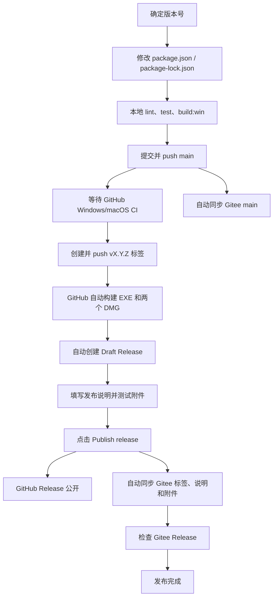

# Abandon Note 完整发布流程

这是一份只面向“正式发布新版本”的操作手册。

目标是从已经开发完成的代码开始，最终得到：

- GitHub 上公开的正式 Release；
- Gitee 上内容和附件一致的正式 Release；
- Windows x64 安装包；
- macOS Intel x64 安装包；
- macOS Apple 芯片 arm64 安装包；
- 可以被应用更新模块检测到的新版本。

当前仓库：

- GitHub：<https://github.com/feimingabandon/abandon_note2>
- Gitee：<https://gitee.com/zou-feiming/abandon_note2>
- 发布源：GitHub
- 国内镜像及下载源：Gitee
- 主分支：`main`
- 版本格式：`X.Y.Z`，例如 `0.9.1`
- Git 标签格式：`vX.Y.Z`，例如 `v0.9.1`

## 一、完整流程总览



## 二、发布前必须明确的三件事

### 1. 确定本次版本号

例如准备发布：

```text
0.9.1
```

作用：

- 写入应用内部版本；
- 决定安装包文件名；
- 决定 Git 标签；
- 决定更新模块如何比较新旧版本。

原因：

应用判断更新使用数字语义版本。线上版本必须大于本机版本，才会显示“发现新版本”。

版本规则：

- 第一个数字：重大版本，例如 `1.0.0`
- 第二个数字：功能版本，例如 `0.10.0`
- 第三个数字：修复版本，例如 `0.9.1`

当前只发布稳定版，因此不要使用：

```text
0.9.1-beta
0.9.1-alpha
0.9.1-rc
```

### 2. 确认准备发布的功能已经完成

发布标签代表一个不可随意改变的版本快照。

创建标签前应确认：

- 计划发布的代码已经提交；
- 没有漏掉资源、图标、DLL 或配置文件；
- 没有不应发布的调试代码；
- `git status` 中没有忘记提交的文件。

检查：

```powershell
git status
```

成功标准：

```text
nothing to commit, working tree clean
```

### 3. 确认当前位于 `main`

执行：

```powershell
git branch --show-current
```

应输出：

```text
main
```

作用：

保证发布来自正式主分支，而不是某个临时开发分支。

## 三、修改版本号

以下使用发布 `0.9.1` 举例。

执行：

```powershell
npm version 0.9.1 --no-git-tag-version
```

这会修改：

- `package.json`
- `package-lock.json`

作用：

将应用内部版本设置为 `0.9.1`。

原因：

GitHub 发布工作流会检查：

```text
Git 标签 = v + package.json version
```

如果 `package.json` 是 `0.9.1`，标签必须是 `v0.9.1`。

`--no-git-tag-version` 的作用：

- 只修改版本文件；
- 暂时不自动创建 Git 标签；
- 等代码检查和 GitHub CI 成功后，再人工创建标签。

检查结果：

```powershell
node -p "require('./package.json').version"
```

应输出：

```text
0.9.1
```

注意：

当前项目已经是 `0.9.0`。如果第一次正式发布就是 `v0.9.0`，不需要再次执行版本修改命令。

## 四、本地发布前检查

在 Windows 发布电脑上执行：

```powershell
npm run lint
npm test
npm run build:win
```

### 1. `npm run lint`

作用：

- 检查 JavaScript 和 Vue 代码规范；
- 检查错误的 Vue 模板写法；
- 检查部分危险或不符合项目约束的代码。

原因：

这类问题可能不影响编辑器显示，但会影响 CI 或后续维护。

成功标准：

- 命令退出码为 0；
- 没有 ESLint error。

### 2. `npm test`

作用：

- 运行单元测试；
- 运行数据库集成测试；
- 运行壁纸存储测试；
- 运行附件存储测试。

原因：

“能够编译”不等于“功能正确”。测试用于发现数据、更新、调度和存储逻辑回归。

成功标准：

- 单元测试全部通过；
- 数据库、壁纸、附件集成测试全部通过；
- 命令退出码为 0。

### 3. `npm run build:win`

作用：

1. 编译 Windows C++ `blur_engine.dll`；
2. 编译 Electron 主进程、preload 和 Vue renderer；
3. 使用 electron-builder 和 NSIS 生成 Windows EXE；
4. 生成 `.blockmap`；
5. 验证实际打包配置。

原因：

普通 `npm run build` 只能证明应用代码可以编译，不能证明：

- C++ DLL 能编译；
- DLL 会进入安装包；
- NSIS 配置合法；
- Windows 安装包能生成。

`npm run build:win` 内部已经包含 `npm run build`，所以不用再单独重复运行 `npm run build`。

成功后应看到：

```text
dist/Abandon-Note-0.9.1-windows-x64-setup.exe
dist/Abandon-Note-0.9.1-windows-x64-setup.exe.blockmap
```

本地产物只用于提前检查。最终正式附件由 GitHub Actions 重新构建，不能用本地文件替换云端正式附件。

## 五、提交版本号并推送 `main`

先检查修改：

```powershell
git status
git diff -- package.json package-lock.json
```

提交版本号：

```powershell
git add package.json package-lock.json
git commit -m "chore: prepare v0.9.1"
git push origin main
```

如果本次还有其他准备发布但尚未提交的代码，应先确认文件范围，再把它们放进同一个或更早的明确提交中。

作用：

- 将最终发布代码和版本号送到 GitHub `main`；
- 触发 GitHub CI；
- 触发 Gitee `main` 镜像同步。

原因：

标签必须创建在已经上传并通过 CI 的确定提交上。

普通 `main` push 不会生成正式安装包，因此此时还不会出现 Release。

## 六、等待 GitHub CI 和 Gitee `main` 同步

### GitHub 页面位置

1. 打开 GitHub 仓库；
2. 点击顶部“操作（Actions）”；
3. 左侧点击 `CI`；
4. 打开刚刚由 `main` push 触发的运行记录。

必须看到：

- `Verify (windows-latest)`：成功（Success）
- `Verify (macos-14)`：成功（Success）

CI 会执行：

- Check out repository（签出仓库）
- Set up Node.js（设置 Node.js）
- Install dependencies（安装依赖）
- Lint（代码检查）
- Test（测试）
- Build application（构建应用）

同时检查：

1. GitHub → `Actions`
2. 左侧 `Sync to Gitee`
3. 打开同一提交对应的运行记录
4. `Mirror main branch to Gitee` 应为成功（Success）

作用：

- CI 使用干净的 Windows/macOS 云端环境再次验证；
- Gitee `main` 获得与 GitHub 相同的源代码。

原因：

本机成功不代表 GitHub 的 Windows/macOS 环境一定成功。特别是 macOS 构建只能依靠 macOS 运行器验证。

如果 CI 失败：

- 不要创建版本标签；
- 打开失败任务查看具体步骤；
- 修复代码；
- 重新提交并 push；
- 等新的 CI 全部成功。

## 七、可选：先生成候选测试包

如果希望在正式标签前让测试人员试用，可以手动运行候选构建。

这一步直接在 GitHub 网页完成，不需要使用本地终端：

1. 打开 GitHub 仓库；
2. 点击顶部“操作（Actions）”；
3. 在左侧点击 `Build release candidates`；
4. 点击右侧“运行工作流（Run workflow）”；
5. 在“使用工作流来自（Use workflow from）”中选择 `main`；
6. 点击绿色“运行工作流（Run workflow）”；
7. 等待 `Windows x64`、`macOS x64`、`macOS arm64` 全部成功；
8. 打开本次运行页面底部的“构件（Artifacts）”，下载候选安装包进行测试。

作用：

生成三平台临时测试包：

- Windows x64
- macOS x64
- macOS arm64

原因：

可以在创建正式标签前完成 Windows 10、Windows 11 和两种 Mac 架构测试。

这些文件位于运行页面底部的“构件（Artifacts）”，保留 14 天。

这一步是可选的，并且：

- 不是创建正式标签的强制前提；
- 不创建标签；
- 不创建 Draft Release；
- 不公开发布；
- 不同步 Gitee Release；
- 不会被应用更新模块检测到。

首次发布或更新模块、安装逻辑、原生模块发生变化时，仍然强烈建议执行本步骤并测试候选安装包。

## 八、通过 IntelliJ IDEA 创建并推送正式 Git 标签

本步骤使用 IntelliJ IDEA 的 Git 图形界面完成，不要求使用终端。

### 8.1 创建标签前确认

1. 打开项目根目录的 `package.json`，确认 `version` 是准备发布的版本；
2. 确认版本修改和准备发布的代码已经提交并推送到 GitHub `main`；
3. 确认 GitHub `CI` 已全部成功；
4. 如果执行了第七步，确认候选安装包测试完成；
5. 打开 IDEA 底部 `Git` 工具窗口；
6. 进入“日志（Log）”；
7. 确认最新提交同时标有 `HEAD`、`main`、`origin/main`，表示本地与 GitHub 当前指向同一提交。

第七步是可选项，不是第八步的强制前提；但 GitHub `CI` 成功是正式打标签前的必要检查。

### 8.2 确定标签名称

标签必须满足：

```text
Git 标签 = v + package.json 中的 version
```

例如：

- `package.json` 为 `0.9.0`，标签填写 `v0.9.0`；
- `package.json` 为 `0.9.1`，标签填写 `v0.9.1`。

不能省略标签开头的 `v`，也不能让标签版本与 `package.json` 不一致。

### 8.3 在 IDEA 中创建标签

1. 在 `Git` →“日志（Log）”中找到准备发布的 `main` 最新提交；
2. 右键该提交；
3. 点击“新建标记…（New Tag…）”；
4. 标签名称填写版本对应的标签，例如 `v0.9.0`；
5. 如果出现“消息（Message）”字段，填写 `Abandon Note v0.9.0`；
6. 确认创建标签。

IDEA 中文版将 Git `Tag` 翻译为“标记”，因此“新建标记…”就是“新建标签”。

### 8.4 在 IDEA 中推送标签

1. 点击顶部菜单 `Git` →“推送…（Push…）”；
2. 在推送窗口中启用“推送标签（Push Tags）”；
3. 如果 IDEA 提供范围选择，选择当前标签；没有该选项时选择全部标签；
4. 确认远程仓库是 `origin`；
5. 点击“推送（Push）”；
6. 推送完成后，打开 GitHub 仓库的“操作（Actions）”；
7. 确认出现由该标签触发的 `Build release candidates` 运行记录。

不同 IDEA 版本中，“推送标签（Push Tags）”可能显示在推送窗口、更多选项菜单，或“推送（Push）”按钮旁的下拉菜单中。

作用：

明确告诉 GitHub：

> 使用这个标签指向的提交，构建对应版本的正式安装包。

原因：

发布工作流只监听：

```text
v*
```

普通 `main` push 不会开始正式打包；推送 `v0.9.0`、`v0.9.1` 等符合规则的标签，才会开始正式三平台打包。

标签推送属于发布动作。不要在版本号、CI 或测试尚未确认时提前执行。

## 九、等待 GitHub 自动生成 Draft Release

标签推送后：

1. GitHub 仓库 → “操作（Actions）”
2. 左侧点击 `Build release candidates`
3. 打开由 `v0.9.1` 触发的运行记录

工作流依次执行：

### 1. `Validate release version`

检查：

```text
标签 v0.9.1
package.json 0.9.1
```

作用：

防止标签、应用内部版本和安装包文件名不一致。

### 2. `Windows x64`

执行：

- 安装依赖；
- 编译 C++ 模糊 DLL；
- 检查 DLL 是否存在；
- 编译 Electron 应用；
- 生成 Windows NSIS 安装包；
- 上传 Windows 构件。

### 3. `macOS x64`

生成 Intel Mac DMG。

### 4. `macOS arm64`

生成 Apple 芯片 Mac DMG。

### 5. `Create GitHub Draft Release`

只有 Windows 和两个 macOS 构建全部成功后才执行：

- 下载三个构建任务的产物；
- 生成 `SHA256SUMS.txt`；
- 自动生成 GitHub 发布说明初稿；
- 创建 Draft Release；
- 上传全部附件。

Draft Release 不公开，不会同步到 Gitee，也不会被应用更新检查发现。

## 十、在哪里填写发布版本说明

发布说明应在 GitHub Draft Release 中填写。

### 精确页面路径

1. 打开 GitHub 仓库；
2. 点击“版本（Releases）”；
3. 找到带“草稿（Draft）”标记的 `v0.9.1`；
4. 点击“编辑（Edit）”；
5. 找到发布说明编辑框：
   - 英文界面通常显示 `Describe this release`
   - 也可以理解为 Release notes（发布说明）
6. 在这里修改和填写正式说明；
7. 填完后暂时不要立即发布，先检查附件。

工作流使用 `--generate-notes`，因此 GitHub 会先自动生成一份提交和 Pull Request 摘要。它只是初稿，可以全部修改或替换。

### 推荐发布说明模板

```markdown
## Abandon Note v0.9.1

### 新增

- 新增……
- 新增……

### 改进

- 优化……
- 调整……

### 修复

- 修复……
- 修复……

### 下载说明

- Windows 10/11 x64：下载 `Abandon-Note-0.9.1-windows-x64-setup.exe`
- Intel Mac：下载 `Abandon-Note-0.9.1-macos-x64.dmg`
- Apple 芯片 Mac：下载 `Abandon-Note-0.9.1-macos-arm64.dmg`

### 安装说明

- Windows 可以直接覆盖安装，不需要先卸载。
- macOS 当前未签名和公证，首次打开时可能出现系统安全提示。
- 建议安装前正常退出旧版本。

### 文件校验

安装包 SHA-256 见 `SHA256SUMS.txt`。
```

### 为什么必须在 Publish 前填好

当前 Gitee 同步工作流只监听：

```text
release: published
```

点击 Publish 时，GitHub Release 的标题和说明会被读取并同步到 Gitee。

如果发布后才修改 GitHub 说明，当前工作流不会因为 `edited` 事件自动再次同步。因此：

- 最好在点击 Publish 前把说明写完整；
- 发布后如果只修改了 GitHub，需要同时人工修改 Gitee；
- 或者以后扩展工作流，让它监听 Release edited 事件。

## 十一、检查 Draft 的正式附件

正常应有 6 个附件：

1. `Abandon-Note-0.9.1-windows-x64-setup.exe`
2. `Abandon-Note-0.9.1-windows-x64-setup.exe.blockmap`
3. `latest.yml`
4. `Abandon-Note-0.9.1-macos-x64.dmg`
5. `Abandon-Note-0.9.1-macos-arm64.dmg`
6. `SHA256SUMS.txt`

各文件作用：

- Windows EXE：Windows 用户安装；
- macOS x64 DMG：Intel Mac 用户安装；
- macOS arm64 DMG：Apple 芯片 Mac 用户安装；
- `SHA256SUMS.txt`：校验附件是否完整；
- `.blockmap`：electron-builder 的差分块元数据，当前自定义更新模块不使用；
- `latest.yml`：electron-builder 的更新元数据，当前自定义更新模块不使用。

至少检查：

- 6 个附件全部存在；
- 文件大小不是 0；
- 文件名和版本正确；
- EXE 可以启动 NSIS 安装器；
- Windows 可以选择安装位置；
- Windows 覆盖安装后便签数据还在；
- Windows C++ 模糊效果能运行；
- Intel DMG 能在 Intel Mac 打开；
- arm64 DMG 能在 Apple 芯片 Mac 打开；
- 两种 DMG 没有架构放反。

Draft 中的附件才是准备正式发布的文件。不要用本地 `dist` 或先前的 Actions Artifact 代替本次 Draft 附件进行最终验收。

## 十二、正式发布 GitHub Release

在 Draft 的编辑页面确认：

- 标签（Tag）：`v0.9.1`
- 标题（Release title）：建议 `Abandon Note v0.9.1`
- 发布说明：已经填写完成
- 附件：6 个且测试通过
- “设为预发布版（Set as a pre-release）”：不要勾选
- “设为最新版本（Set as the latest release）”：保持勾选或默认最新

最后点击：

```text
发布版本（Publish release）
```

作用：

- 将 Draft 变为公开 GitHub Release；
- 允许用户从 GitHub 下载；
- 让 GitHub `/releases/latest` 返回该版本；
- 触发 Gitee Release 同步；
- 让应用更新模块开始看到这个公开版本。

原因：

Draft 只是管理员草稿。只有 Publish 后才是真正对用户发布。

`Publish release` 是不可忽略的对外发布步骤。点击前应完成附件测试和说明检查。

## 十三、GitHub 自动同步 Gitee Release

点击 Publish 后，GitHub 自动运行 `Sync to Gitee`。

页面位置：

1. GitHub 仓库 → “操作（Actions）”
2. 左侧 `Sync to Gitee`
3. 打开由 Release 发布触发的运行记录
4. 找到 `Sync published Release to Gitee`

它会执行：

1. 验证 `GITEE_TOKEN`；
2. 将 `v0.9.1` 标签推送到 Gitee；
3. 下载 GitHub Release 的全部附件；
4. 读取 GitHub Release 标题；
5. 读取 GitHub Release 发布说明；
6. 查询 Gitee 是否已有同标签 Release；
7. 没有则创建，已有则更新；
8. 删除 Gitee 中的同名旧附件；
9. 上传 GitHub 的最新附件。

作用：

让国内用户可以直接从 Gitee 下载相同版本。

原因：

GitHub 是唯一构建和发布源，Gitee 是镜像。避免分别手工上传导致两个平台的文件不一致。

不需要在本机执行 Gitee push，也不需要手动上传 Gitee 附件。

### Gitee 同步失败后的手动补同步

不要重新发布 GitHub Release，也不要删除或重建标签。先修复同步脚本并推送到 `main`，再使用新的工作流版本补同步：

1. GitHub 仓库 → “操作（Actions）”；
2. 左侧点击 `Sync to Gitee`；
3. 点击右侧“运行工作流（Run workflow）”；
4. “使用工作流来自（Use workflow from）”选择 `main`；
5. 在“已公开的 GitHub Release 标签”填写准确标签，例如 `v0.9.0`；
6. 点击绿色“运行工作流（Run workflow）”；
7. 等待 `Sync published Release to Gitee` 成功；
8. 打开 Gitee 的“发行版（Releases）”检查标题、说明和附件。

输入留空时，手动运行只验证 `GITEE_TOKEN` 和仓库 API 访问；填写标签才会同步已公开 Release。修复工作流后，不应直接重跑旧失败记录，因为旧记录仍使用当时的脚本版本。

## 十四、检查 Gitee 发布结果

GitHub Actions 中 `Sync published Release to Gitee` 成功后：

1. 打开 Gitee 仓库；
2. 进入“发行版（Releases）”；
3. 打开 `v0.9.1`；
4. 检查：
   - 标签一致；
   - 标题一致；
   - 发布说明一致；
   - 6 个附件齐全；
   - 附件文件名和大小合理；
5. 实际点击并下载至少一个附件。

作用：

确认“工作流显示成功”之外，用户实际访问的 Gitee 页面也正确。

原因：

API 上传成功不代表用户侧下载体验一定正常，必须至少测试一次真实链接。

## 十五、验证应用更新

使用仍安装旧版本的电脑，例如旧版 `0.9.0` 检查新版 `0.9.1`。

### Windows

1. 启动旧版 Abandon Note；
2. 等待启动自动检查，或进入：
   - 设置
   - 关于
   - 检查更新
3. 应显示：
   - 当前版本 `0.9.0`
   - 最新版本 `0.9.1`
   - Windows 正确 EXE 文件名
   - 在线下载更新
   - Gitee 下载
   - GitHub 下载
4. 点击在线下载；
5. 检查下载进度；
6. 下载完成后点击“安装更新并退出”；
7. 完成覆盖安装；
8. 重新打开应用；
9. 设置 → 关于应显示 `v0.9.1`；
10. 再次检查应显示“已经是最新版本 / 当前无需下载任何安装包”。

### macOS Intel

- 应提示 `Abandon-Note-0.9.1-macos-x64.dmg`；
- 只显示 Gitee/GitHub 手动下载，不显示在线安装。

### macOS Apple 芯片

- 应提示 `Abandon-Note-0.9.1-macos-arm64.dmg`；
- 只显示 Gitee/GitHub 手动下载，不显示在线安装。

注意：

首次发布 `v0.9.0` 时，已经运行 `0.9.0` 的测试用户只会看到“已经是最新版本”。要真实验证新版提示，需要发布大于 `0.9.0` 的版本，例如 `0.9.1`。

## 十六、常见失败及处理

### 1. CI 失败

处理：

- 不创建标签；
- 查看失败步骤；
- 修复并重新 push `main`；
- 等待新 CI 成功。

### 2. 标签与版本号不一致

表现：

`Validate release version` 失败。

原因示例：

```text
package.json = 0.9.1
Git 标签 = v0.9.0
```

处理：

- 停止发布；
- 不要点击 Publish；
- 先确认应该使用哪个版本；
- 再谨慎处理错误标签。

删除或改写已经公开的标签会影响用户和发布历史，因此不应在未确认目标前执行删除操作。

### 3. Windows 构建失败

重点检查：

- C++ `blur_engine.dll` 编译；
- electron-builder 配置；
- NSIS 配置；
- Windows 原生依赖。

### 4. macOS 构建失败

重点检查：

- x64/arm64 架构；
- macOS runner；
- DMG 配置；
- 未签名相关配置。

### 5. Draft 缺少附件

处理：

- 不要 Publish；
- 打开 `Build release candidates`；
- 查看 Windows/macOS/Draft 哪个任务失败；
- 使用“重新运行任务（Re-run jobs）”。

### 6. GitHub 已发布，但 Gitee 同步失败

处理：

1. 打开失败日志，确认失败发生在哪一步；
2. 如果是临时网络或 Gitee API 波动，可直接使用“重新运行任务（Re-run jobs）”；
3. 如果需要修改同步脚本，先修复并 push 到 `main`；
4. 然后按“Gitee 同步失败后的手动补同步”填写已公开标签，运行新的 `Sync to Gitee` 工作流；
5. 再检查 Gitee Release。

不要为了解决 Gitee 同步失败而重复创建新的 GitHub Release。

## 十七、什么状态才算发布完成

以下全部完成才算正式发布结束：

- [ ] `package.json` 和 `package-lock.json` 版本正确
- [ ] 本地 lint 通过
- [ ] 本地测试通过
- [ ] 本地 Windows NSIS 打包通过
- [ ] 最终代码和版本号已 push 到 GitHub `main`
- [ ] GitHub Windows CI 成功
- [ ] GitHub macOS CI 成功
- [ ] Gitee `main` 同步成功
- [ ] `vX.Y.Z` 标签已创建并推送
- [ ] GitHub 三平台正式构建成功
- [ ] Draft Release 已生成
- [ ] 发布说明已在 Draft 中填写
- [ ] 6 个附件齐全
- [ ] 正式附件已由测试人员验证
- [ ] 已点击 `Publish release`
- [ ] GitHub Release 已公开
- [ ] Gitee Release 同步任务成功
- [ ] Gitee 标签、说明、附件齐全
- [ ] Gitee/GitHub 下载链接已抽查
- [ ] 旧版 Windows 更新检测和下载已验证
- [ ] 两种 Mac 显示正确 DMG 文件名

## 十八、本次 `v0.9.0` 的最短路径

当前情况：

- `package.json` 已经是 `0.9.0`；
- 最新代码已经在 GitHub `main`；
- GitHub Windows/macOS CI 已成功；
- Gitee `main` 已同步。

因此不需要再修改版本号，也不需要为了发布重复提交一次代码。

确认要开始第一次 Draft 后，在 IntelliJ IDEA 中创建并推送标签：

1. 底部 `Git` →“日志（Log）”；
2. 确认最新提交同时标有 `HEAD`、`main`、`origin/main`；
3. 右键该提交 →“新建标记…（New Tag…）”；
4. 标签填写 `v0.9.0`，消息填写 `Abandon Note v0.9.0`；
5. 顶部 `Git` →“推送…（Push…）”；
6. 启用“推送标签（Push Tags）”，确认远程为 `origin`；
7. 点击“推送（Push）”。

随后：

1. 等待 `Build release candidates`；
2. 打开自动生成的 `v0.9.0` Draft；
3. 填写发布说明；
4. 下载并测试 6 个附件；
5. 点击 `Publish release`；
6. 等待 Gitee Release 自动同步；
7. 检查 GitHub/Gitee 下载页面。

创建并推送 `v0.9.0` 标签会启动真实正式包构建，应在明确确认后执行。
